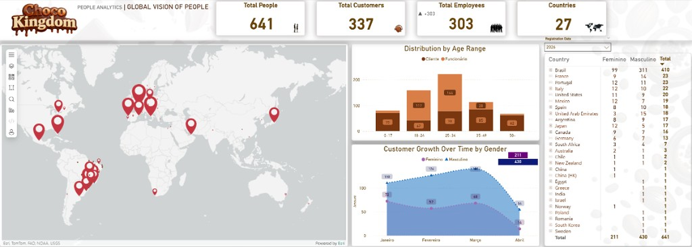
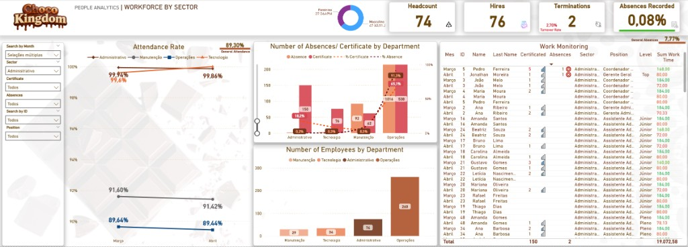

# Choco Kingdom

**PT:** App móvel (parque temático) + API + SQL Server + **People Analytics (Power BI)** — portfólio; dados de exemplo.  
**EN:** Mobile theme-park app + API + SQL Server + **Power BI People Analytics** — portfolio; sample data.

**PT — O que encontrar aqui:** um **app** de experiência de parque (mapa, perfil, área de funcionário com ponto e equipa) ligado a uma **API** e a dados em **SQL Server**. Em paralelo, um **dashboard de People Analytics** no **Power BI**, alimentado por essa mesma linha de dados: presença, ausências, atestados, quadro por setor e visão estratégica de pessoas (perfil, crescimento, geografia).

**EN — What’s here:** a **theme-park style mobile app** plus a **Node API** and **SQL Server** as the system of record, and a **Power BI People Analytics** layer on top of that structured HR/attendance data (operational and strategic views).

> **Aviso:** os dados são **fictícios** e fazem parte de um **projeto pessoal**; não representam uma operação real.  
> **Notice:** the dataset is **fictional** and for a **personal portfolio**; it does not represent a real company.

**LinkedIn:** [Jonathan S. Moreira](https://www.linkedin.com/in/jonathansmoreira/)

---

## Onde ir no repositório | Where to go

| O quê | Link |
|--------|------|
| **Power BI** (narrativa detalhada + SQL) | [`docs/POWER_BI_PEOPLE_ANALYTICS.md`](docs/POWER_BI_PEOPLE_ANALYTICS.md) |
| **Fluxo do app** (ecrãs, calendário de presença + **vídeo**) | [`docs/FLUXO_APP_SIMPLES.md`](docs/FLUXO_APP_SIMPLES.md) |
| **Documentação técnica** (stack, API, BD, pastas) | [`docs/DOCUMENTACAO_PROJETO_CACAU_APP.md`](docs/DOCUMENTACAO_PROJETO_CACAU_APP.md) |

---

## People Analytics — Power BI

Trechos em alta resolução (crescimento por género, taxa de presença), painéis completos, texto PT/EN e SQL: **[docs/POWER_BI_PEOPLE_ANALYTICS.md](docs/POWER_BI_PEOPLE_ANALYTICS.md)**.

| Visão estratégica (painel completo) | Visão operacional (painel completo) |
| :---: | :---: |
|  |  |

---

## App (preview)

Guia não técnico com prints e vídeo do calendário: **[docs/FLUXO_APP_SIMPLES.md](docs/FLUXO_APP_SIMPLES.md)**.
