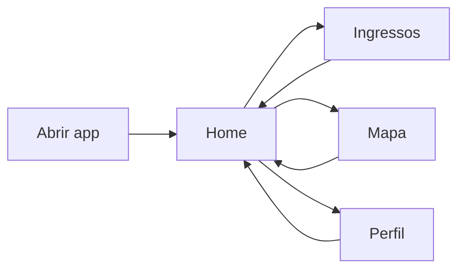
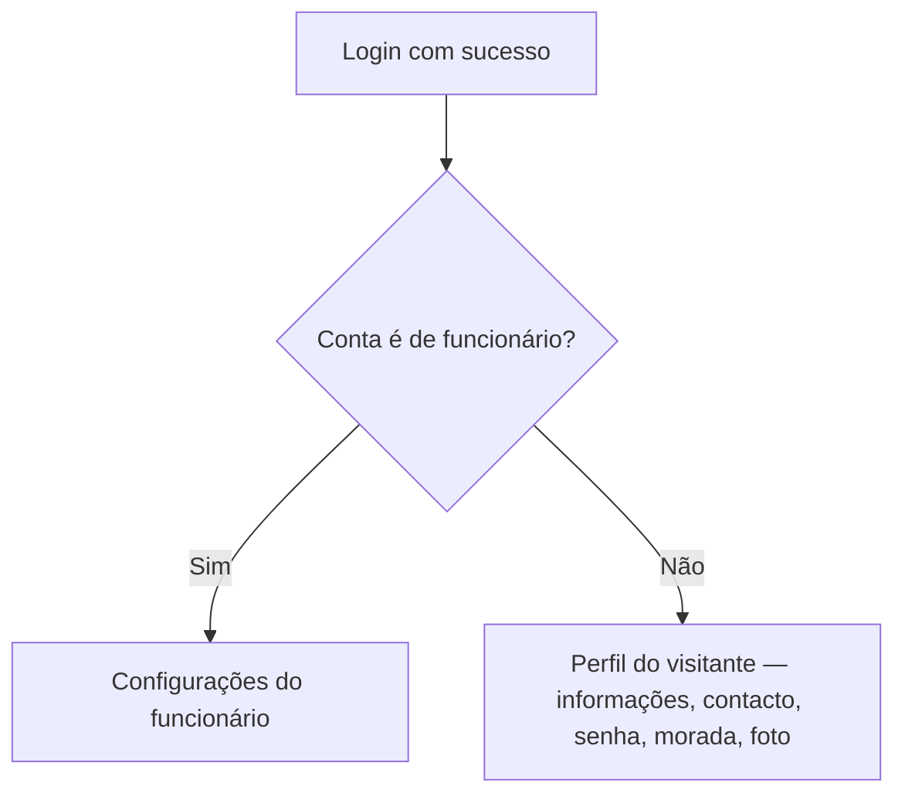

# Choco Kingdom — Como usar o app (guia para quem não é da área técnica)

Este guia explica **para que serve** o aplicativo, **o que pode fazer** em cada área e **por onde começar** quando abre o telemóvel. É um complemento à [documentação técnica do projeto](DOCUMENTACAO_PROJETO_CACAU_APP.md).

> **Imagens:** Os exemplos abaixo referem ficheiros em [`docs/imagens-fluxo/`](imagens-fluxo/README.md). Depois de colocar os prints com os nomes certos, eles aparecem automaticamente aqui e no GitHub.

---

## Para que serve o Choco Kingdom?

O **Choco Kingdom** é um app de telemóvel pensado para a experiência de um **parque temático**: explorar conteúdos na **Home**, ver o **mapa** com atrações e serviços, gerir o **perfil** (conta, dados, senha) e, para quem trabalha no parque, aceder a **ferramentas de funcionário** (equipa, presença, cargos, comunicação interna).

Na base, o app fala com um **servidor** (API) que guarda dados numa base **SQL Server** — utilizador normal não precisa de saber isso; basta ter o app instalado e rede (por exemplo Wi‑Fi na mesma rede que o servidor, em modo desenvolvimento).

---

## Como navegar: as quatro abas de baixo

Em quase todo o app vê **quatro botões** na parte inferior:

| Aba | O que é |
|-----|---------|
| **Home** | Página inicial com destaques (lojas, eventos, atrações) e atalhos para o mapa. |
| **Ingressos** | Área preparada para bilhética; pode mostrar “em construção” conforme a versão. |
| **Mapa** | Mapa ilustrado do parque: zoom, deslocar, tocar nos pontos (atrações, comida, WC, etc.). |
| **Perfil** | Conta: **login**, **cadastro**, ou **menu da conta** depois de entrar. |

Fluxo geral:

---

## Entrar na conta: visitante vs funcionário

Quando toca em **Perfil** e **ainda não entrou**, aparece o ecrã de **acesso** (e-mail, senha, opção **Entrar com Google**, criar conta, etc.).

**Regra importante:**

- Se a conta estiver marcada no sistema como **funcionário** (`Funcionario` ativo), depois do login o app encaminha para a área de **Configurações do funcionário** (gestão de staff).
- Se for uma **conta de visitante** normal, depois do login permanece no fluxo de **perfil de utilizador**: dados pessoais, contacto (onde pode **alterar e-mail**, telefone, etc.), senha, morada, foto e opção de sair.

Isto não depende do botão que tocámos antes — depende do **tipo de conta** que o servidor reconhece para o seu e-mail.

---

## Perfil do visitante (conta normal)

No **perfil** depois de entrar, quem **não** é funcionário vê um menu em cartão com opções típicas de conta:

- **Informações pessoais** — nome e dados básicos.
- **Informações de contacto** — inclui dados para **atualizar e-mail** e telefone (conforme regras do servidor).
- **Senha** — alterar palavra-passe.
- **Endereço** — morada associada à conta.
- **Excluir conta** — pedido de remoção da conta.
- **Sair** — terminar sessão no telemóvel.

---

## Funcionário: Configurações do funcionário

Quem entra como **funcionário** acede ao hub **Configurações do funcionário**: desde ali abre cadastro, cargos, equipa, documentos, comunicados, etc. Há também o bloco **“Está em serviço agora?”** (Sim / Não) para alinhar o estado de trabalho com o sistema.

### Exemplo: Cadastro de cargos

Quem tem permissão pode **definir cargos** (nome, superior, setor, nível, descrição) e consultar o **catálogo** existente (incluindo cargos de sistema).

### Exemplo: Equipe e presença

Visão da **equipa do setor**, filtros (todos / em serviço / fora de serviço), pesquisa por nome ou ID, mudança de mês e ícone de **calendário** por pessoa para rever presenças.

*(Os ecrãs exactos dependem do seu papel no parque e do que o administrador ativou na base de dados.)*

---

## Mapa do parque

Na aba **Mapa**:

1. Vê o **mapa ilustrado** (zoom e mover com o dedo).
2. Toca nos **ícones** no mapa para abrir detalhes do local.
3. Pode abrir a **legenda**: categorias (ex.: banheiros, comida, diversão) e lista com filas, restrições de altura, etc.

---

## Home e Ingressos

- **Home:** boas-vindas, carrosséis (lojas, eventos, atrações), atalhos para o mapa com filtro por tipo.
- **Ingressos:** pode ser uma mensagem de **em desenvolvimento** até existir integração de venda de bilhetes.

---

## Resumo rápido

| Quero… | Onde… |
|--------|--------|
| Entrar ou criar conta | **Perfil** (sem estar logado). |
| Mudar e-mail ou telefone | **Perfil** → **Informações de contacto** (visitante). |
| Ver o mapa | **Mapa**. |
| Ferramentas de trabalho | Login como **funcionário** → **Configurações do funcionário**. |
| Explorar novidades | **Home**. |

---

## Documentação relacionada no repositório

- [Documentação técnica e funcionalidades](DOCUMENTACAO_PROJETO_CACAU_APP.md)
- [Deploy / portfolio / URL da API](PORTFOLIO_DEPLOY.md)
- [Onde colocar os prints](imagens-fluxo/README.md)

---

*Última atualização do texto: fluxo alinhado às capturas de ecrã fornecidas pelo autor do projeto.*
