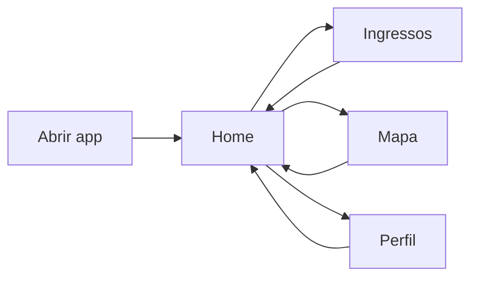
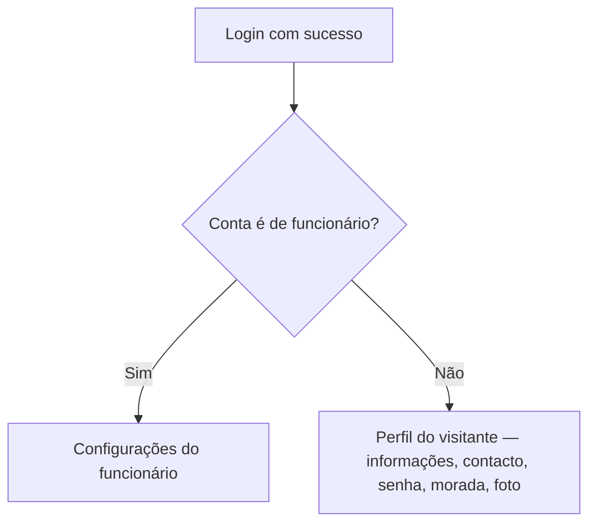
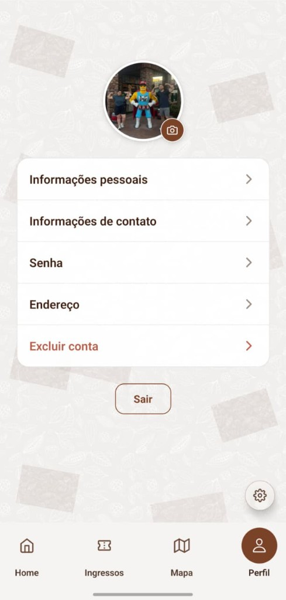
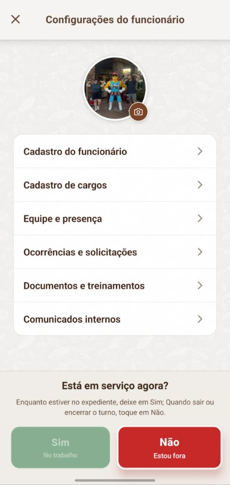
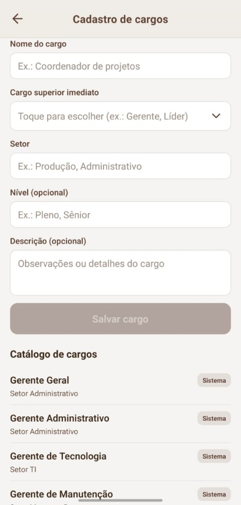
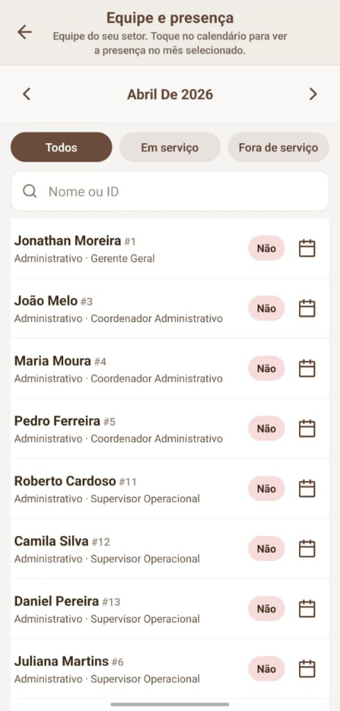
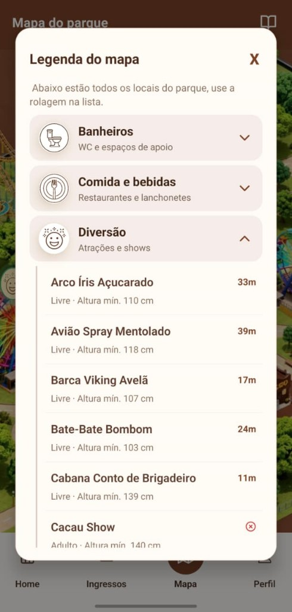

# Choco Kingdom — Como usar o app (guia para quem não é da área técnica)

Este guia explica **para que serve** o aplicativo, **o que pode fazer** em cada área e **por onde começar** quando abre o telemóvel. É um complemento à [documentação técnica do projeto](DOCUMENTACAO_PROJETO_CACAU_APP.md).

As figuras usam PNG em `docs/imagens-fluxo/` com os nomes indicados no [apêndice no fim desta página](#apendice-imagens-fluxo).

---

## Para que serve o Choco Kingdom?

O **Choco Kingdom** é um app de telemóvel pensado para a experiência de um **parque temático**: explorar conteúdos na **Home**, ver o **mapa** com atrações e serviços, gerir o **perfil** (conta, dados, senha) e, para quem trabalha no parque, aceder a **ferramentas de funcionário** (equipa, presença, cargos, comunicação interna).

O app comunica com uma **API** e dados em **SQL Server** (detalhes na documentação técnica). Para quem só usa o produto: em geral basta **internet**; em **desenvolvimento**, o telemóvel e o PC onde corre a API costumam estar na **mesma rede Wi‑Fi**.

---

## Como navegar: as quatro abas de baixo

Em quase todo o app vê **quatro botões** na parte inferior:

| Aba | O que é |
|-----|---------|
| **Home** | Página inicial com destaques (lojas, eventos, atrações) e atalhos para o mapa. |
| **Ingressos** | Área preparada para bilhética; pode mostrar “em construção” conforme a versão. |
| **Mapa** | Mapa ilustrado do parque: zoom, deslocar, tocar nos pontos (atrações, comida, WC, etc.). |
| **Perfil** | Conta: **login**, **cadastro**, ou **menu da conta** depois de entrar. |

Fluxo geral:



---

## Entrar na conta: visitante vs funcionário

Quando toca em **Perfil** e **ainda não entrou**, aparece o ecrã de **acesso** (e-mail, senha, opção **Entrar com Google**, criar conta, etc.).


**Regra importante:**

- Se a conta estiver marcada no sistema como **funcionário** (`Funcionario` ativo), depois do login o app encaminha para a área de **Configurações do funcionário** (gestão de staff).
- Se for uma **conta de visitante** normal, depois do login permanece no fluxo de **perfil de utilizador**: dados pessoais, contacto (onde pode **alterar e-mail**, telefone, etc.), senha, morada, foto e opção de sair.

Isto não depende do botão que tocámos antes — depende do **tipo de conta** que o servidor reconhece para o seu e-mail.



---

## Perfil do visitante (conta normal)

No **perfil** depois de entrar, quem **não** é funcionário vê um menu em cartão com opções típicas de conta:

- **Informações pessoais** — nome e dados básicos.
- **Informações de contacto** — inclui dados para **atualizar e-mail** e telefone (conforme regras do servidor).
- **Senha** — alterar palavra-passe.
- **Endereço** — morada associada à conta.
- **Excluir conta** — pedido de remoção da conta.
- **Sair** — terminar sessão no telemóvel.



---

## Funcionário: Configurações do funcionário

Quem entra como **funcionário** acede ao hub **Configurações do funcionário**: desde ali abre cadastro, cargos, equipa, documentos, comunicados, etc. Há também o bloco **“Está em serviço agora?”** (Sim / Não) para alinhar o estado de trabalho com o sistema.



### Exemplo: Cadastro de cargos

Quem tem permissão pode **definir cargos** (nome, superior, setor, nível, descrição) e consultar o **catálogo** existente (incluindo cargos de sistema).



### Exemplo: Equipe e presença

Visão da **equipa do setor**, filtros (todos / em serviço / fora de serviço), pesquisa por nome ou ID, mudança de mês e ícone de **calendário** por pessoa para rever presenças.



*(Os ecrãs exactos dependem do seu papel no parque e do que o administrador ativou na base de dados.)*

### Exemplo: Calendário de presença

Na lista **Equipe e presença**, o ícone de **calendário** na linha de cada pessoa abre a vista **mensal** daquela pessoa. Cada dia mostra o estado vindo do servidor (presente, falta, folga, atestado, etc.).

- **Mês:** no topo do calendário escolhes outro mês para rever histórico.
- **Toque num dia:** com permissão de **gestão de ponto**, serve para o fluxo **rápido** de marcação (quem não tem essa permissão sobre aquele colaborador não usa o mesmo atalho).
- **Toque longo num dia:** abre o **detalhe do dia** — falta, atestado (com imagem do documento, se existir), folga, justificativa e horários de ponto (entrada, almoço, saída) quando existirem.
- **Gestos (swipe) no calendário:** em contas de **gestão** há atalhos (por exemplo folga / justificativa); no **próprio** calendário o colaborador trata sobretudo de tudo por **toque longo** → detalhe, sem os mesmos gestos rápidos de quem coordena.
- **Folga no próprio dia:** só quem tem **cargo compatível** (ex.: gerente / coordenador ou regra equivalente no app) marca folga diretamente; outros perfis seguem fluxo com justificativa.

**Vídeo do fluxo** no telemóvel (app Choco Kingdom). O leitor abaixo é **vídeo** (usa **play** ▶); a miniatura inicial é só um **frame** do mesmo ecrã (`08-calendario-presenca-thumb.png`), não substitui o vídeo.

<video poster="imagens-fluxo/08-calendario-presenca-thumb.png" src="imagens-fluxo/calendario-presenca-screen-recording.mp4" controls playsinline preload="metadata" width="380" style="max-width:100%;height:auto;display:block;margin:0 auto;"></video>

*Se o vídeo não carregar no browser, abre o ficheiro `calendario-presenca-screen-recording.mp4` na pasta `docs/imagens-fluxo/` (clone local ou vista Raw no GitHub).*

---

## Mapa do parque

Na aba **Mapa**:

1. Vê o **mapa ilustrado** (zoom e mover com o dedo).
2. Toca nos **ícones** no mapa para abrir detalhes do local.
3. Pode abrir a **legenda**: categorias (ex.: banheiros, comida, diversão) e lista com filas, restrições de altura, etc.




---

## Home e Ingressos

- **Home:** boas-vindas, carrosséis (lojas, eventos, atrações), atalhos para o mapa com filtro por tipo.
- **Ingressos:** pode ser uma mensagem de **em desenvolvimento** até existir integração de venda de bilhetes.

---

## Resumo rápido

| Quero… | Onde… |
|--------|--------|
| Entrar ou criar conta | **Perfil** (sem estar logado). |
| Mudar e-mail ou telefone | **Perfil** → **Informações de contacto** (visitante). |
| Ver o mapa | **Mapa**. |
| Ferramentas de trabalho | Login como **funcionário** → **Configurações do funcionário**. |
| Explorar novidades | **Home**. |

---

## Documentação relacionada no repositório

- [Documentação técnica e funcionalidades](DOCUMENTACAO_PROJETO_CACAU_APP.md)

---

<a id="apendice-imagens-fluxo"></a>

## Apêndice: capturas (pasta docs/imagens-fluxo)

O guia referencia estes ficheiros (para o Markdown do GitHub os mostrar, têm de existir no repositório com estes nomes):

| Ficheiro | Conteúdo sugerido |
|----------|-------------------|
| `01-login-perfil-visitante.png` | Ecrã de login (aba Perfil, visitante) |
| `02-configuracoes-funcionario.png` | Configurações do funcionário |
| `03-cadastro-cargos.png` | Cadastro de cargos |
| `04-mapa-legenda.png` | Mapa — legenda / lista de locais |
| `05-equipe-presenca.png` | Equipe e presença |
| `06-mapa-parque.png` | Mapa do parque (vista principal) |
| `07-perfil-visitante-logado.png` | Perfil do visitante após login |
| `08-calendario-presenca-thumb.png` | Frame para **poster** do vídeo (miniatura antes de dar play) |
| `calendario-presenca-screen-recording.mp4` | Vídeo — calendário de presença (versão leve para o GitHub) |

Para copiar vários prints de uma pasta (ex.: exportados do telemóvel) e renomear nesta ordem:

```powershell
.\scripts\copiar-prints-fluxo.ps1 -Source "$env:USERPROFILE\Downloads\prints-choco"
```

(Ajusta `-Source` para a tua pasta; depois confere se a ordem dos ficheiros bate com a tabela e corrige nomes à mão se preciso.)
