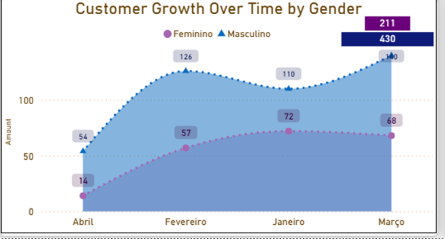
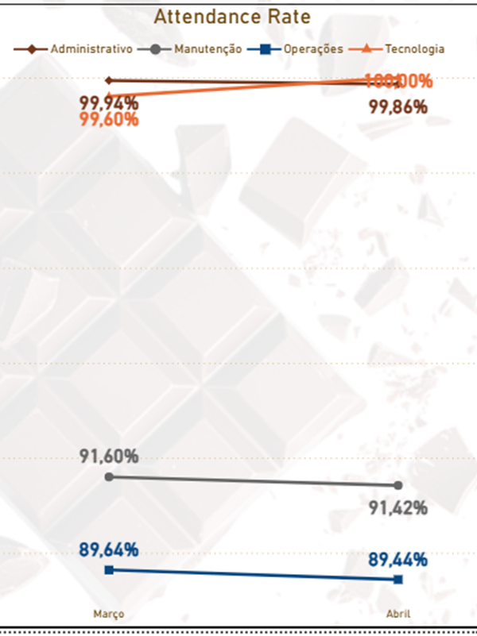

# People Analytics — Power BI | Choco Kingdom

> **Portfolio:** cenário corporativo de exemplo com dados fictícios (RH / pessoas). Secções em **EN** e **PT**.

Este projeto apresenta um **dashboard de People Analytics** desenvolvido no **Power BI**, com foco em análise de **presença**, **absenteísmo** e **visão estratégica de pessoas**. Os dados alimentam-se de uma base **SQL Server** estruturada (incluindo registo diário de ponto).

**Aviso:** os dados utilizados são **fictícios** e fazem parte de um **projeto pessoal**; não representam uma operação real.

---

## English

This portfolio adds a **Power BI** layer on top of structured HR / attendance data in **SQL Server**: two complementary pages — **operational** (workforce by sector, attendance, absences vs certificates) and **strategic** (people, customers, geography, demographics, growth). The dataset is **fictional**.

**Stack:** Power Query, dimensional model, **DAX** (time intelligence, HR metrics), layout for different audiences. **SQL Server** for validation and business rules.

A **detailed narrative** (charts, definitions, sector behaviour, limitations, next steps) is in the **Portuguese** section below. The **SQL** snippet at the end illustrates absenteeism with the correct denominator (excluding scheduled days off).

---

## Português — Visão geral dos relatórios

- **Operacional — “Workforce by sector”** — acompanhamento do dia a dia: evolução da taxa de presença por setor, indicadores de quadro (headcount, admissões, desligamentos), separação entre **falta** e **atestado**, tabela detalhada por colaborador.
- **Estratégica — “Global vision of people”** — visão macro: KPIs, mapa, distribuição por idade (clientes vs funcionários), crescimento de cadastros por género, tabela por país.

**Stack:** Power Query, modelo dimensional, **DAX**, UI por persona. **SQL Server** para validar regras de negócio.

---

## Painéis completos (referência)

<p align="center"></p>

<p align="center"></p>

---

## Crescimento de clientes por género

Acompanha a **evolução temporal** das novas adesões, comparando tendências entre **Feminino** e **Masculino** (área temporal do painel estratégico).

<p align="center"></p>

---

## Taxa de presença (Attendance rate)

Esta métrica avalia a **assiduidade real** da equipa. A regra de cálculo cruza os dias em que houve **marcação de ponto efectiva** (presença) com os **dias úteis previstos** para trabalho. Para manter a métrica fiel, **dias de folga** ou **inatividade justificada** são **excluídos** do denominador: o foco fica nos dias em que o colaborador **devia** estar presente.

<p align="center"></p>

### Por que Tecnologia e Administrativo ficam quase em 100%?

É um padrão frequente: escritório e TI tendem a ter **maior flexibilidade** (híbrido, compensação de horas, menor dependência de presença física contínua no chão). Quando há indisposição leve, muitas vezes o fluxo é **trabalhar remoto** ou **recuperar horas**, não uma falta registada.

**Nota:** no conjunto de exemplo, **Tecnologia** chega a **100%** num dos meses analisados — ou seja, com as folgas excluídas da lógica, não há falta injustificada (nem buraco de registo indevido) para esse grupo no período.

### Operações (~89%) e Manutenção (~91%)

Também faz sentido operacional: **chão de fábrica**, **campo** ou **maquinário** exigem **corpo presente**. Transporte, desgaste físico e imprevistos do dia a dia pressionam mais estes indicadores.

Uma taxa de presença na ordem dos **89%** em Operações significa, em ordem de grandeza, que num dia com **100** pessoas escaladas cerca de **10 a 11** não estão presentes como previsto — com impacto em produção e possível aumento de **horas extraordinárias** para cobertura.

---

## Ausências registadas (absences recorded)

Funciona como um medidor do **volume de faltas**. A regra **isola** ausências (dias sem marcação e **sem** folga ou justificativa válida associada) e olha para a sua proporção face ao volume de dias em que se esperava trabalho. É o indicador principal para perceber **que parte da força de trabalho faltou** no período.

---

## Principais insights e conclusão

- O conjunto combina **monitorização operacional** (presença e faltas), **análise estratégica** (perfil e crescimento) e uma **base estruturada** (ponto electrónico diário).
- **Operações** concentra o maior impacto nos indicadores; o **absenteísmo geral** mantém-se estável na faixa de **cerca de 7% a 8%** no cenário modelado.
- A **separação entre falta e atestado** foi essencial para evitar leituras superficiais sobre ausências e para distinguir **disciplina** de **contexto de saúde**.

---

## Desafios do projeto e melhorias futuras

O maior desafio técnico envolve a **modelagem entre tabelas** e alguns **limites visuais** da ferramenta. Do lado de negócio, o ponto estrutural em falta é uma **previsão de escala de trabalho** por setor e por pessoa.

### Limitação do cálculo de “absenteeism rate”

Sem uma base que diga **exactamente** qual era a escala prevista de cada funcionário por dia, o cálculo “absoluto” de absenteísmo fica **limitado**. Integrar **planeamento de turnos** permitiria análises mais próximas do custo real e do cumprimento de plano.

### O que ainda não dá para fechar só com estes dados

- Impacto financeiro directo da ausência (custo estimado por hora/perda).
- Soma das **horas perdidas** fragmentadas por setor.
- Custo do absenteísmo na folha, comparável ao **banco de horas** de forma automática e consistente.

---

## English — Summary (same story, shorter)

- **Attendance rate** excludes scheduled time off so the metric reflects **days when attendance was expected**.
- **Admin / Tech** clusters near **100%**; **Operations / Maintenance** are lower — typical **frontline vs office** pattern. A ~**89%** attendance day with **100** scheduled people implies on the order of **10–11** people not present as planned.
- Splitting **unjustified absence** vs **medical certificate** avoids misleading “one number” storytelling.
- **Next step:** integrate **planned schedules / shifts** to strengthen absenteeism and cost analytics.

---

## SQL — absenteísmo (denominador sem folgas)

Granularidade típica: **um registo por colaborador por dia** (`PontoEletronicoDia` ou equivalente no teu schema).

```sql
-- Padrão simplificado: faltas só em dias que não são folgas marcadas
SELECT
  SUM(CASE WHEN Falta = 1 THEN 1 ELSE 0 END) * 1.0
    / NULLIF(SUM(CASE WHEN Folga = 0 THEN 1 ELSE 0 END), 0) AS AbsenteeismRate
FROM PontoEletronicoDia;
```
