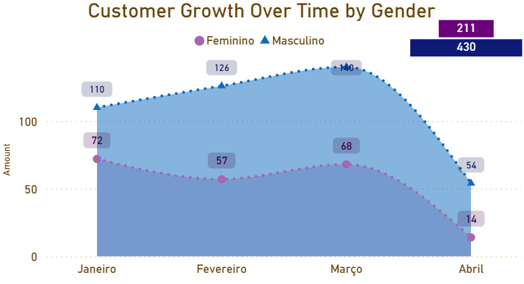

# People Analytics — Power BI | Choco Kingdom

> **Portfolio:** cenário corporativo de exemplo com dados fictícios (RH / pessoas). Secções em **EN** e **PT**.

Este projeto apresenta um **dashboard de People Analytics** desenvolvido no **Power BI**, com foco em análise de **presença**, **absenteísmo** e **visão estratégica de pessoas**. Os dados alimentam-se de uma base **SQL Server** estruturada (incluindo registo diário de ponto).

**Aviso:** os dados utilizados são **fictícios** e fazem parte de um **projeto pessoal**; não representam uma operação real.

---

## English

This portfolio adds a **Power BI** layer on top of structured HR / attendance data in **SQL Server**: two complementary pages — **operational** (workforce by sector, attendance, absences vs certificates) and **strategic** (people, customers, geography, demographics, growth). The dataset is **fictional**.

**Stack:** Power Query, dimensional model, **DAX** (time intelligence, HR metrics), layout for different audiences. **SQL Server** for validation and business rules.

The sections below alternate **Portuguese** and **English** for the same topics. The **SQL** snippet at the end illustrates absenteeism with the correct denominator (excluding scheduled days off).

---

## Português — Visão geral dos relatórios

- **Operacional — “Workforce by sector”** — acompanhamento do dia a dia: evolução da taxa de presença por setor, indicadores de quadro (headcount, admissões, desligamentos), separação entre **falta** e **atestado**, tabela detalhada por colaborador.
- **Estratégica — “Global vision of people”** — visão macro: KPIs, mapa, distribuição por idade (clientes vs funcionários), crescimento de cadastros por género, tabela por país.

**Stack:** Power Query, modelo dimensional, **DAX**, UI por persona. **SQL Server** para validar regras de negócio.

---

## Painéis completos (referência) | Full dashboards (reference)

[](readme/power-bi-strategic-global-vision.png)

[](readme/power-bi-operational-workforce-by-sector.png)

---

## Crescimento de clientes por género | Customer growth by gender

**Português** — Acompanha a **evolução temporal** das novas adesões, comparando tendências entre **Feminino** e **Masculino** (área temporal do painel estratégico).

**English** — Tracks **sign-up growth over time**, comparing **Female** and **Male** trends (strategic page).

[](readme/power-bi-viz-crescimento-clientes-genero-v2.png)

---

## Taxa de presença | Attendance rate

**Português** — Esta métrica avalia a **assiduidade real** da equipa. A regra de cálculo cruza os dias em que houve **marcação de ponto efectiva** (presença) com os **dias úteis previstos** para trabalho. Para manter a métrica fiel, **dias de folga** ou **inatividade justificada** são **excluídos** do denominador: o foco fica nos dias em que o colaborador **devia** estar presente.

**English** — This metric measures **real attendance**. It compares days with **actual clock-in/out** (presence) against **expected working days**. **Scheduled days off** and **justified non-work** are **excluded** from the denominator so the measure reflects days when the person **should** have been at work.

[](readme/power-bi-viz-taxa-presenca-setores.png)

### Por que Tecnologia e Administrativo ficam quase em 100%? | Why are Tech and Admin near 100%?

**Português** — É um padrão frequente: escritório e TI tendem a ter **maior flexibilidade** (híbrido, compensação de horas, menor dependência de presença física contínua no chão). Quando há indisposição leve, muitas vezes o fluxo é **trabalhar remoto** ou **recuperar horas**, não uma falta registada.

**Nota (exemplo):** **Tecnologia** chega a **100%** num dos meses analisados — com folgas excluídas da lógica, não há falta injustificada (nem registo em falta indevido) para esse grupo no período.

**English** — Office and IT often show **higher flexibility** (hybrid work, hour banks, less need for continuous on-site presence). Mild illness may show up as **remote work** or **time recovery**, not a logged absence.

**Sample note:** **Technology** hits **100%** in one analysed month — with days off excluded, there is no unjustified absence (or bad null) for that team in the period.

### Operações (~89%) e Manutenção (~91%) | Operations (~89%) and Maintenance (~91%)

**Português** — Também faz sentido operacional: **chão de fábrica**, **campo** ou **maquinário** exigem **corpo presente**. Transporte, desgaste físico e imprevistos do dia a dia pressionam mais estes indicadores. Uma taxa de presença na ordem dos **89%** em Operações significa, em ordem de grandeza, que num dia com **100** pessoas escaladas cerca de **10 a 11** não estão presentes como previsto — com impacto em produção e possível aumento de **horas extraordinárias** para cobertura.

**English** — **Shop floor**, **field**, or **machinery** need **physical presence**. Commuting, physical strain, and daily surprises weigh more on these rates. Roughly **89%** attendance in Operations means that with **100** people scheduled, about **10–11** may not show as planned — affecting output and possibly **overtime** for cover.

---

## Ausências registadas | Absences recorded

**Português** — Funciona como um medidor do **volume de faltas**. A regra **isola** ausências (dias sem marcação e **sem** folga ou justificativa válida associada) e olha para a sua proporção face ao volume de dias em que se esperava trabalho. É o indicador principal para perceber **que parte da força de trabalho faltou** no período.

**English** — It measures **absence volume**. The logic **isolates** absences (no clocking and **no** valid day-off or justification) and compares them to days where work was **expected**. It shows **what share of the workforce was missing** in the period.

---

## Desafios do projeto e melhorias futuras | Project challenges and future improvements

**Português** — O maior desafio técnico envolve a **modelagem entre tabelas** e alguns **limites visuais** da ferramenta. Do lado de negócio, o ponto estrutural em falta é uma **previsão de escala de trabalho** por setor e por pessoa.

**English** — The main technical challenge is **table relationships** and some **visual limits** in the tool. On the business side, the missing piece is a **planned work schedule** by sector and person.

### Limitação do cálculo de “absenteeism rate” | Limitation of the “absenteeism rate” calculation

**Português** — Sem uma base que diga **exactamente** qual era a escala prevista de cada funcionário por dia, o cálculo “absoluto” de absenteísmo fica **limitado**. Integrar **planeamento de turnos** permitiria análises mais próximas do custo real e do cumprimento de plano.

**English** — Without data that states **exactly** each employee’s **planned** schedule per day, the “absolute” absenteeism rate stays **limited**. Integrating **shift planning** would unlock closer cost and plan-compliance analysis.

### O que ainda não dá para fechar só com estes dados | What these data still cannot close

**Português**

- Impacto financeiro directo da ausência (custo estimado por hora/perda).
- Soma das **horas perdidas** fragmentadas por setor.
- Custo do absenteísmo na folha, comparável ao **banco de horas** de forma automática e consistente.

**English**

- Direct **financial impact** of absence (estimated cost per hour/loss).
- **Fragmented lost hours** summed by sector.
- Absence cost on payroll, aligned with **time banks** in an automated, consistent way.

---

## Principais insights e conclusão | Key insights and conclusion

**Português**

- O conjunto combina **monitorização operacional** (presença e faltas), **análise estratégica** (perfil e crescimento) e uma **base estruturada** (ponto electrónico diário).
- **Operações** concentra o maior impacto nos indicadores; o **absenteísmo geral** mantém-se estável na faixa de **cerca de 7% a 8%** no cenário modelado.
- A **separação entre falta e atestado** foi essencial para evitar leituras superficiais sobre ausências e para distinguir **disciplina** de **contexto de saúde**.

**English**

- The work combines **operational monitoring** (presence and absences), **strategic analysis** (profile and growth), and a **structured base** (daily time records).
- **Operations** drives the largest impact on indicators; overall **absenteeism** stays in a **~7–8%** band in the modelled scenario.
- Splitting **unjustified absence** and **medical certificate** was key to avoid shallow reads and to separate **discipline** from **health context**.

---

## SQL — absenteísmo (denominador sem folgas) | SQL — absenteeism (denominator excl. days off)

Granularidade típica: **um registo por colaborador por dia** (`PontoEletronicoDia` ou equivalente).

Typical grain: **one row per employee per day** (`PontoEletronicoDia` or equivalent).

```sql
-- Padrão simplificado: faltas só em dias que não são folgas marcadas
-- Simplified pattern: absences only on days that are not scheduled off
SELECT
  SUM(CASE WHEN Falta = 1 THEN 1 ELSE 0 END) * 1.0
    / NULLIF(SUM(CASE WHEN Folga = 0 THEN 1 ELSE 0 END), 0) AS AbsenteeismRate
FROM PontoEletronicoDia;
```
